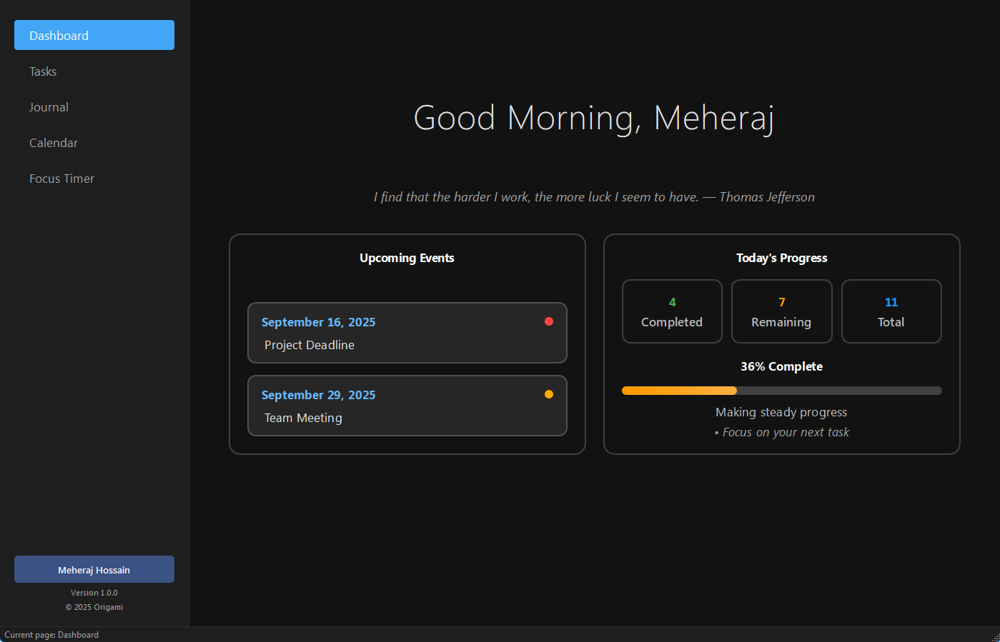

<p align="center">
  
</p>

<h1 align="center" style="font-size: 40px;">Origami - Personal Productivity & Wellness App</h1>

[](https://python.org)
[](https://pypi.org/project/PySide6/)
[](LICENSE)

**Origami** is a comprehensive desktop productivity and wellness application built with Python and PySide6. It combines essential productivity tools in a clean and modern interface.

## ✨ Features


<p align="center">
  
</p>


### 🏠 **Dashboard**
- **Time-based greetings** - Personalized welcome messages based on time of day
- **Motivational quotes** - Daily inspiration to keep you motivated
- **Task completion overview** - Visual progress tracking of your daily tasks
- **Upcoming events** - Quick view of your calendar events
- **Clean, modern interface** - Professionally designed UI with dark/light theme support

### ✅ **Task Management**
- **Simple todo creation** - Quick task entry with intuitive interface
- **Task completion tracking** - Visual progress indicators and statistics
- **Modern list interface** - Clean, organized task display
- **Real-time updates** - Instant sync between dashboard and task views

### 📝 **Digital Journal**
- **Secure journaling** - Optional password protection for privacy
- **Rich text editing** - Advanced text formatting capabilities
- **Date-based entries** - Organized by date for easy navigation
- **Search functionality** - Find entries quickly with built-in search
- **Encrypted storage** - Your thoughts remain private and secure

### 📅 **Smart Calendar**
- **Event management** - Create, edit, and delete calendar events
- **Modern calendar view** - Clean, intuitive month/week navigation
- **Dashboard integration** - Upcoming events shown on main dashboard
- **Time-aware scheduling** - Smart event organization

### ⏰ **Focus Timer (Pomodoro)**
- **Customizable sessions** - Adjustable work and break durations
- **Session tracking** - Monitor your focus sessions and productivity
- **Desktop notifications** - Stay informed without watching the clock
- **Professional timer interface** - Distraction-free focus environment

### 👤 **User Profile Management**
- **Personal customization** - Set your name and display preferences
- **Theme switching** - Choose between light and dark modes
- **Security settings** - Manage password protection for sensitive features
- **Personalized experience** - Tailored greetings and interface

## 🚀 Installation

### Prerequisites
- **Python 3.8 or higher**
- **Windows, macOS, or Linux**

### Option 1: Quick Setup (Recommended)

1. **Clone the repository**
   ```bash
   git clone https://github.com/yourusername/origami.git
   cd origami
   ```

2. **Install dependencies**
   ```bash
   pip install -r requirements.txt
   ```

3. **Run the application**
   ```bash
   python main.py
   ```

### Option 2: Virtual Environment (Recommended for Development)

1. **Clone and navigate**
   ```bash
   git clone https://github.com/yourusername/origami.git
   cd origami
   ```

2. **Create virtual environment**
   ```bash
   python -m venv venv
   
   # On Windows
   venv\Scripts\activate
   
   # On macOS/Linux
   source venv/bin/activate
   ```

3. **Install dependencies**
   ```bash
   pip install -r requirements.txt
   ```

4. **Launch Origami**
   ```bash
   python main.py
   ```

## 💻 How to Use

### Getting Started

1. **Launch the application** by running `python main.py`
2. **Set up your profile** by clicking the "User" button in the sidebar
3. **Customize your experience** by choosing your preferred theme (light/dark)
4. **Start being productive!** 

## 🤝 Contributing

We welcome contributions to make Origami even better! Here's how you can help:

### Getting Started

1. **Fork the repository** on GitHub
2. **Clone your fork** locally
   ```bash
   git clone https://github.com/yourusername/origami.git
   ```
3. **Create a feature branch**
   ```bash
   git checkout -b feature/amazing-feature
   ```
4. **Set up development environment**
   ```bash
   python -m venv venv
   source venv/bin/activate  # On Windows: venv\Scripts\activate
   pip install -r requirements.txt
   ```

### Contributing

Want to help improve Origami? Here’s how you can pitch in:

- 🐛 **Found a bug?** Open an issue and let me know what went wrong.  
- ✨ **Have an idea?** Share a feature request with a short description.  
- 🔧 **Want to code?** Fork the repo, make your changes, and open a pull request.  
- 📖 **Docs & cleanup count too!** Fix typos, update the README, or add examples. 

## 📄 License

This project is licensed under the **MIT License** - see the [LICENSE](LICENSE) file for details.

*Origami - Fold your chaos into clarity*


