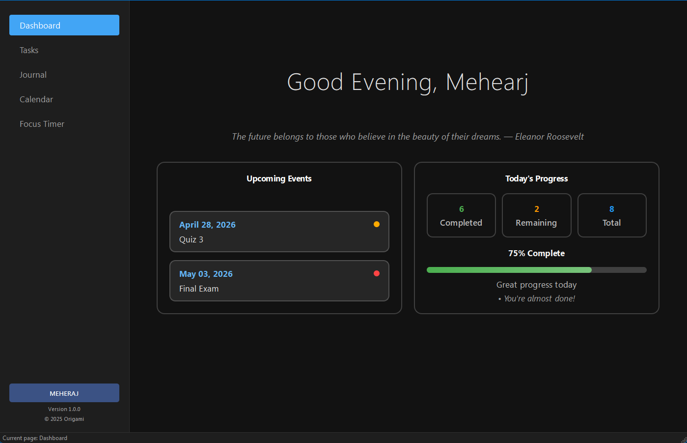

<p align="center">
  
</p>

<h1 align="center">Origami</h1>

<p align="center">
  <strong>Personal Productivity & Wellness — Desktop Application</strong>
</p>

<p align="center">
  <a href="https://python.org"></a>
  <a href="https://pypi.org/project/PySide6/"></a>
  <a href="LICENSE"></a>
  
</p>

<p align="center">
  
</p>

---

## Overview

Origami is a desktop productivity and wellness application built with Python and PySide6. It brings together task management, journaling, calendar scheduling, and focus timing into a single cohesive interface, designed to reduce friction and help you build consistent daily habits.

---

## Features

### Dashboard
The dashboard is your home base. It shows time-based greetings, motivational prompts, a live task completion summary, and upcoming calendar events all in one place, so you always know where things stand without digging through menus.

### Task Management
Create, complete, and track tasks with a minimal interface built for speed. Progress indicators update in real time across the dashboard and task views, keeping your status visible without manual refreshes.

### Digital Journal
A private journaling environment with optional password protection and encrypted local storage. Entries are organized by date, searchable by keyword, and support rich text formatting for structured or freeform writing.

### Calendar
You can create, edit, and delete events across a clean monthly and weekly calendar view. Anything coming up soon will automatically appear on your dashboard so nothing slips through the cracks.

### Focus Timer (Pomodoro)
Configurable work and break session lengths with session logging and desktop notifications. Designed to be distraction-free: start a session and stay in flow.

### User Profile
Set your display name, switch between light and dark themes, and manage security settings for password-protected features. Preferences are persisted across sessions.

---

## Installation

**Requirements:** Python 3.8 or higher on Windows, or Linux.

### Standard Setup

```bash
git clone https://github.com/meheraj-hossain95/origami.git
cd origami
pip install -r requirements.txt
python main.py
```

### Virtual Environment (Recommended)

```bash
git clone https://github.com/meheraj-hossain95/origami.git
cd origami

python -m venv venv

# On Windows
venv\Scripts\activate

# On Linux
source venv/bin/activate

pip install -r requirements.txt
python main.py
```

---

## Getting Started

1. Run `python main.py` to launch the application.
2. Open **Profile** from the sidebar to set your name and preferred theme.
3. Add your first tasks, journal entry, or calendar event from the respective sections.
4. Use the Focus Timer when you're ready to work in structured sessions.
---

## Contributing

Contributions are welcome. To get started:

1. Fork the repository and clone your fork.
2. Create a feature branch: `git checkout -b feature/your-feature-name`
3. Set up a virtual environment and install dependencies.
4. Make your changes with clear, descriptive commits.
5. Open a pull request with a summary of what was changed and why.

For bugs, open an issue with reproduction steps and your environment details. For feature requests, open an issue with a clear description of the problem it solves.

---

## License

Released under the [MIT License](LICENSE).

---
